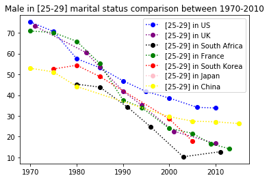
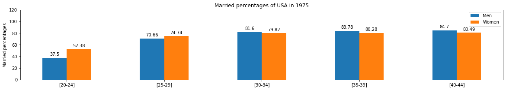
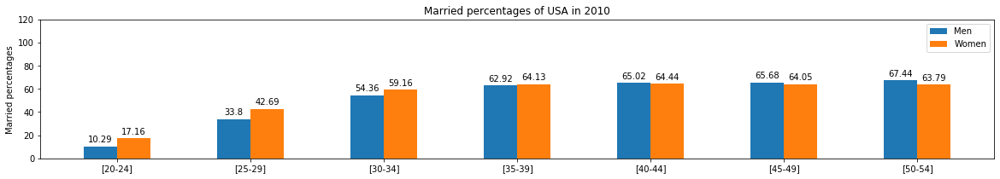
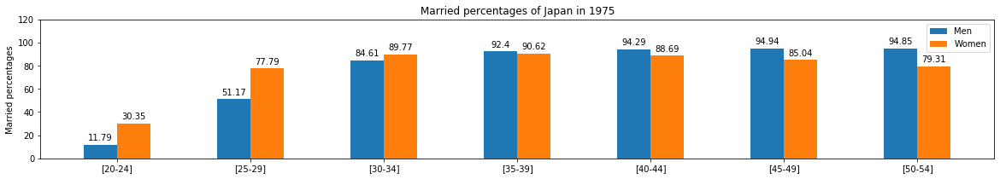
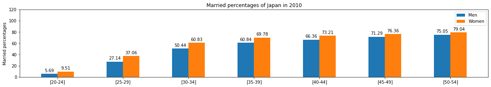
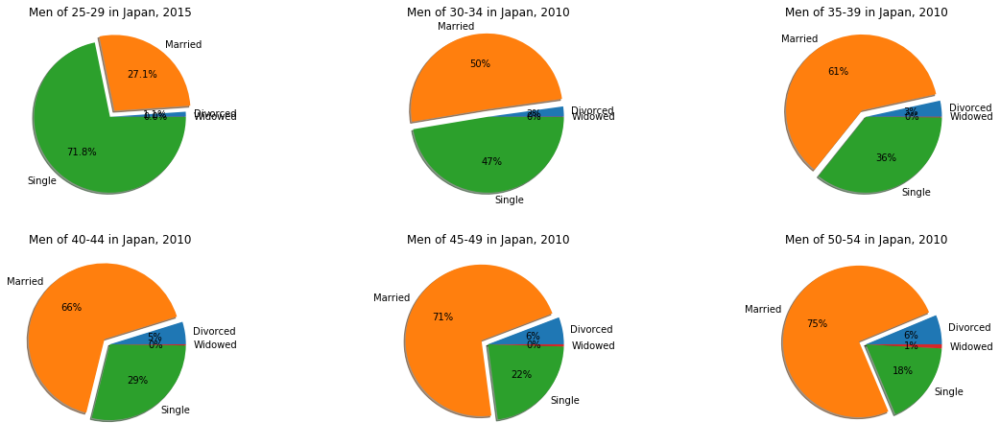

# Marital_Stat
Doing visualized analysis based on World Marriage Data 2017 from UN with Python Numpy, Pandas, Matplotlib. 

# Examples
- Using line charts to demonstrate the marital status changes in different countries between 1970 and 2010.

- Using bar charts to demonstrate the marital status comparison between genders in US and Japan.

- Using pie charts to demonstrate the comparison among different marital status in Japan.

